# ResumeIQ

[](LICENSE)
[](https://psresumeiq.streamlit.app/)

An AI-powered resume analyzer that compares your resume against a job description and gives you an ATS score breakdown, skill-gap analysis, AI-written insights, rewrite suggestions, a cover letter, and interview prep — all in one place.

*(Formerly "AI Resume Analyzer" — renamed for a clearer identity.)*

**[Try it live](https://psresumeiq.streamlit.app/)** — no install required.

## Features

- Upload PDF/DOCX resumes
- Resume text extraction
- Rule-based ATS compatibility score, broken down by category (keyword match, quantified achievements, resume length, contact info)
- Skill-gap analysis across a 130+ skill taxonomy (languages, frameworks, cloud, databases, tools, soft skills)
- TF-IDF content similarity score between resume and job description, as a lexical complement to exact skill matching
- AI-powered resume analysis and improvement suggestions (via OpenRouter)
- AI-powered resume bullet-point rewrite suggestions, tailored to the job description
- AI-generated, tone-adjustable cover letter, editable before download
- AI-generated interview prep kit (tailored questions + suggested answers + role tips)
- Compare multiple resumes against the same job description side by side, ranked by ATS score
- Session history: revisit or reload any past analysis from the current session without re-uploading or re-running AI calls
- Step-by-step progress during analysis, and automatic retry with backoff on transient AI-provider errors (rate limits, timeouts, 5xx)
- Downloadable PDF analysis report

## Tech Stack

- Python
- Streamlit
- OpenAI SDK (via OpenRouter)
- PyMuPDF (PDF parsing)
- python-docx (DOCX parsing)
- Plotly (skill-match donut chart, resume comparison bar chart)
- scikit-learn (TF-IDF content similarity)
- Pandas (resume comparison table)
- Pydantic (AI response validation)
- fpdf2 (PDF report generation)
- tenacity (retry with backoff on transient AI-provider errors)

## Project Status

Live and feature-complete (v1.2) — core pipeline plus rewrite suggestions, cover letter generation, multi-resume comparison, session history, a refreshed professional UI, and a public deployment; ongoing polish and bug fixes.

## Roadmap

- [x] Project setup
- [x] Streamlit UI
- [x] Resume parsing
- [x] ATS scoring (with category breakdown)
- [x] AI suggestions
- [x] PDF report generation
- [x] Cover letter generator
- [x] Interview question generator
- [x] Resume rewrite suggestions
- [x] Multi-resume comparison
- [x] Session history
- [x] Automated test suite
- [x] CI (GitHub Actions)
- [x] Docker deployment
- [x] Rebrand + UI refresh (slate + blue theme, feature showcase)
- [x] Live deployment (Streamlit Community Cloud)

## Testing

```bash
pip install -r requirements-dev.txt
pytest -v
```

Tests cover the rule-based scoring logic (ATS breakdown, skill matching,
content similarity), Pydantic model validation, resume parsing, the
multi-resume comparison pipeline, session history, and the "no API key
configured" error path for every AI service. A GitHub Actions workflow
(`.github/workflows/tests.yml`) runs the suite on every push and pull
request to `main`.

## Docker

```bash
docker build -t resumeiq .
docker run -p 8501:8501 --env-file .env resumeiq
```

Then open http://localhost:8501.

## Setup

```bash
python -m venv venv
venv\Scripts\activate        # Windows
pip install -r requirements.txt
```

Create a `.env` file in the project root:

```
OPENROUTER_API_KEY=your_key_here
```

Run the app (must use `streamlit run`, not `python app.py`):

```bash
streamlit run app.py
```

## Screenshots

**Landing page** -- feature overview and quick access to every mode.

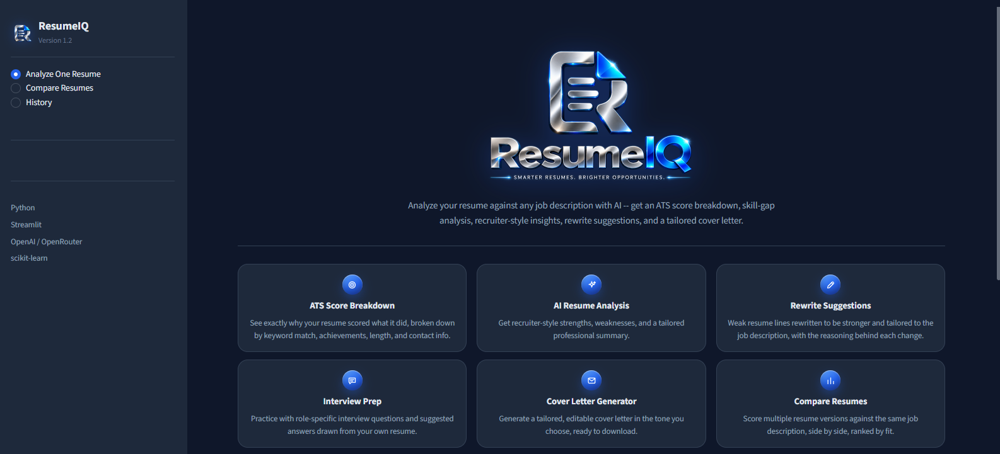

**Upload & job description** -- drop in a resume and paste the job description to analyze.

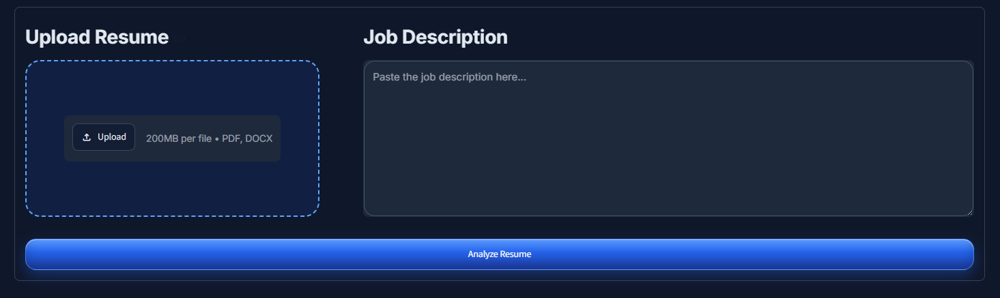

**Instant summary** -- a quick-glance popup the moment analysis finishes.

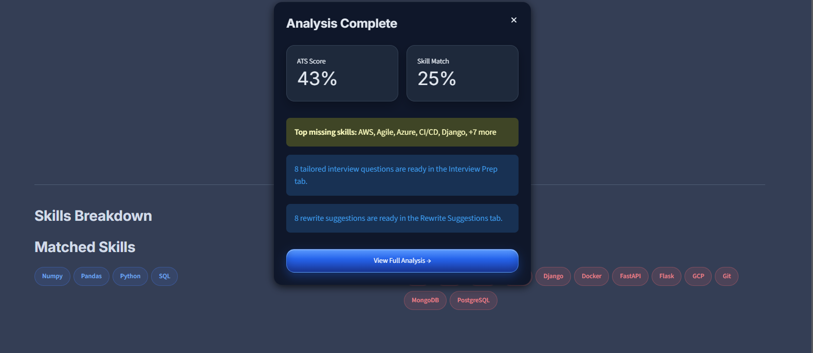

**Dashboard overview** -- ATS score, skill match, matched/missing skill counts, and content similarity at a glance.

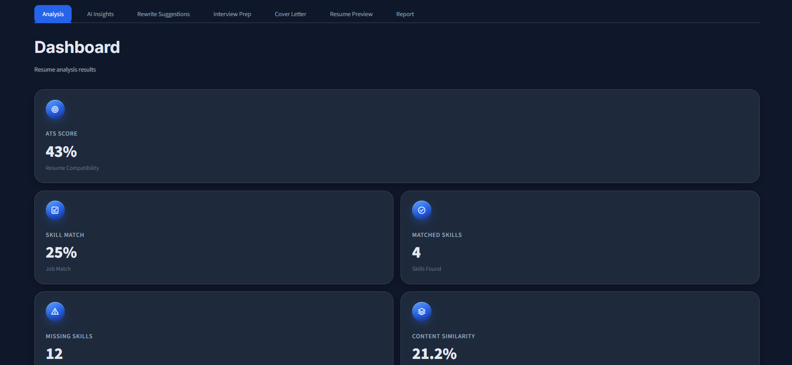

**ATS score breakdown** -- exactly why the resume scored what it did, by category.

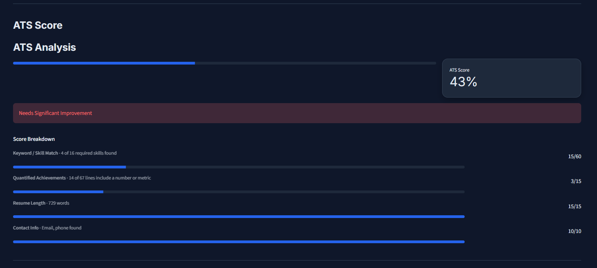

**Skill-gap analysis** -- matched vs. missing skills against the job description.

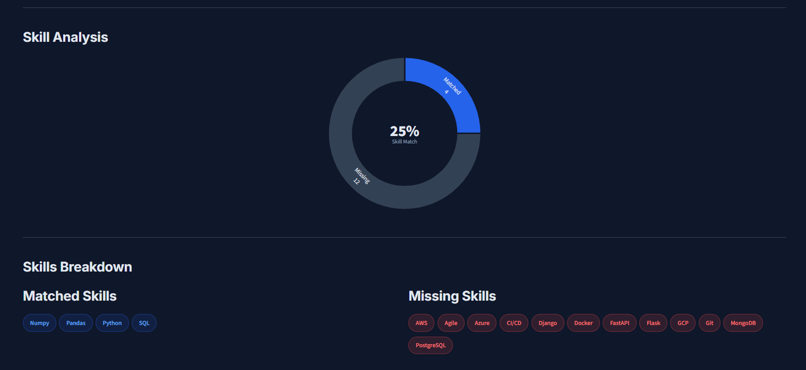

**AI resume analysis** -- recruiter-style strengths, weaknesses, and a tailored professional summary.

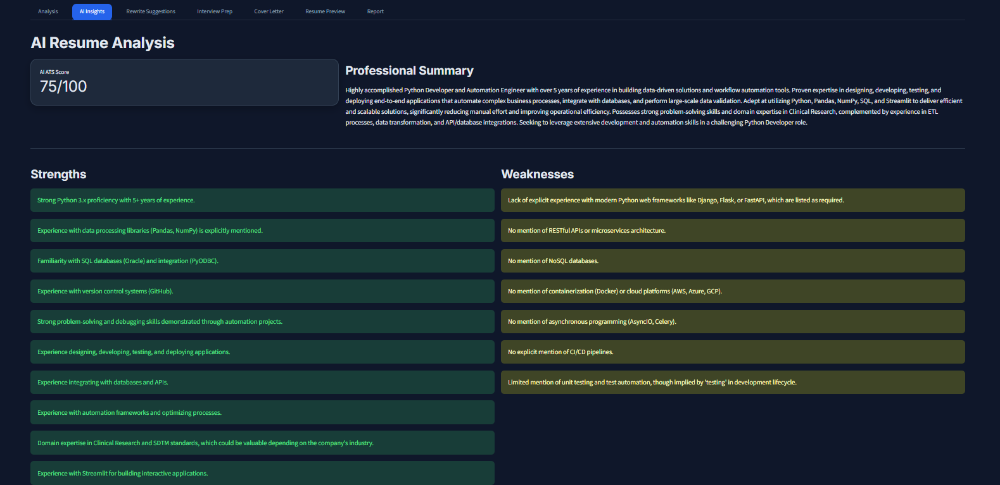

**Rewrite suggestions** -- weak resume lines rewritten and tailored to the job description, with reasoning.

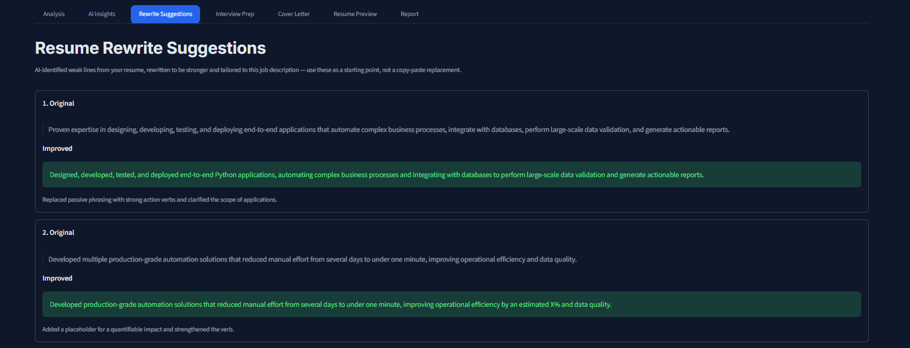

**Interview prep** -- tailored interview questions with suggested answers drawn from the resume.

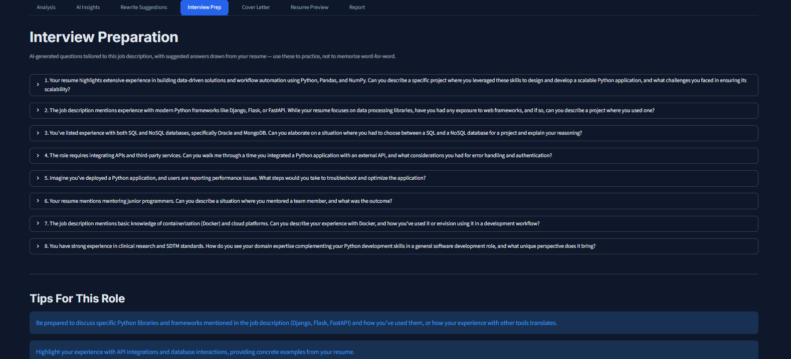

**Cover letter generator** -- a tailored, editable cover letter in the tone you choose.

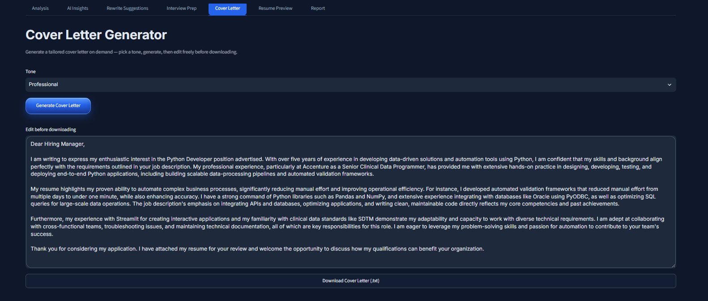

**Downloadable report** -- export the full analysis as a PDF.

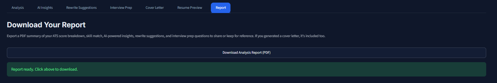

**Compare resumes** -- score multiple resume versions against the same job description, side by side.

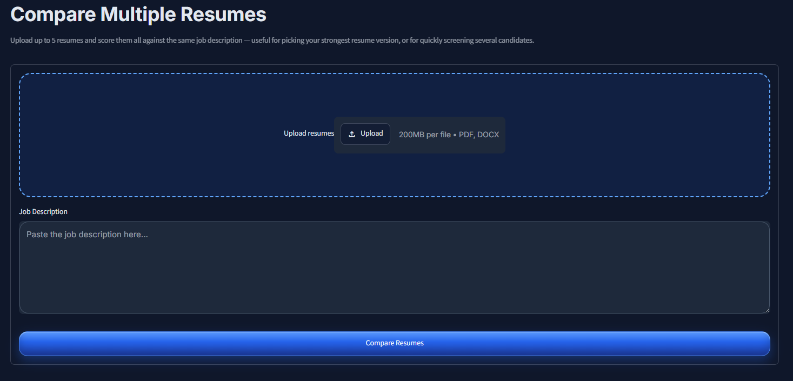

## License

MIT — see [LICENSE](LICENSE).

## Contact

Prathik Shetty — [GitHub](https://github.com/Pranay-Shetty) — shettyprathik0409@gmail.com
